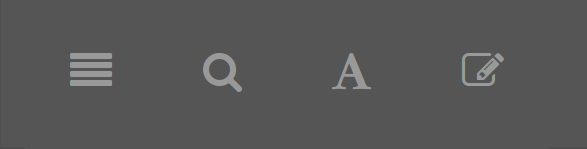

--- 
title: "febr -- Catálogo de Conjuntos de Dados"
site: bookdown::bookdown_site
subtitle: "Conheça detalhadamente as características de cada um dos conjuntos de dados abertos do solo. Saiba como os dados foram gerados e dê os devidos créditos às pessoas e instituições responsáveis."
output: bookdown::gitbook
github-repo: febr-team/febr-catalog
description: "Repositório Brasileiro Livre para Dados Abertos do Solo -- Catálogo de Conjuntos de Dados"
url: http\://www.ufsm.br/febr/
apple-touch-icon: "img/apple-touch-icon.png"
favicon: "img/favicon.ico"
---

```{r, eval=FALSE}
# AFTER BUILDING THE BOOK, EDIT FILE '/docs/libs/gitbook-2.6.7/js/plugin-bookdown.js' TO MAKE SURE THAT THE
# SITE HEADING BACKGROUND COLOR IS CORRECT.
# js <- list.files(path = ".", recursive = TRUE)
# idx <- grepl(pattern = "/js/plugin-bookdown.js", x = js)
# file <- js[idx]
# js <- readLines(con = file)
# for (i in seq(length(js))) {
#   js[i] <- 
#     gsub(
#       pattern = ".css('background-color', bookBody.css('background-color'))", 
#       replacement = ".css('background-color')", x = js[i], fixed = TRUE)
# }
# writeLines(text = js, con = file)
# AFTER BUILDING THE BOOK, EDIT FILE '/catalog/libs/gitbook-2.6.7/js/plugin-search.js'
js <- list.files(path = ".", recursive = TRUE)
idx <- grepl(pattern = "/js/plugin-search.js", x = js)
file <- js[idx]
js <- readLines(con = file)
for (i in seq(length(js))) {
  js[i] <- 
    gsub(
      pattern = "'placeholder': 'Type to search'", 
      replacement = "'placeholder': 'Escreva para pesquisar'", x = js[i], fixed = TRUE)
}
writeLines(text = js, con = file)
```

# Instruções de uso {-}

<!-- <span class="label label-default">Default Label</span> -->
<!-- <span class="label label-primary">Primary Label</span> -->
<!-- <span class="label label-success">Success Label</span> -->
<!-- <span class="label label-info">Info Label</span> -->
<!-- <span class="label label-warning">Warning Label</span> -->
<!-- <span class="label label-danger">Danger Label</span>  -->

Exitem duas maneiras de navegar pelos conjuntos de dados disponíveis no ***febr***.

Primeiro, você pode usar o índice de conjuntos de dados localizado na lateral esquerda da página. Aqui, cada conjunto de dados é identificado pelo seu código identificador único registrado no ***febr***. Você pode navegar pelos conjuntos de dados no próprio índice ou usando os botões de navegação exibidos à esquerda e direita do corpo da página. Caso você queira alternar a visibilidade do índice, basta pressionar o primeiro botão da barra de ferramentas (Figura \@ref(fig:toolbar)) -- você também pode pressionar a tecla `S` no teclado para obter o mesmo efeito.

```{r toolbar, echo=FALSE, fig.align='center', fig.cap="Barra de ferramentas."}
library(knitr)

```

Para fazer buscas simples no catálogo, use o segundo botão da barra de ferramentas -- o atalho de teclado é `F` (do inglês *Find*). Quando o botão de busca for pressionado, você verá uma caixa de pesquisa aparecer na parte superior do índice. À medida que você digitar na caixa de pesquisa, o índice será filtrado de maneira a exibir os conjuntos de dados que correspondem ao termo usado na pesquisa. Feito isso, você pode usar as teclas de seta para cima e para baixo para destacar o próximo termo da pesquisa na página atual. Quando você pressionar novamente o botão de busca (ou a tecla `F` fora da caixa de pesquisa), o termo da pesquisa será apagado e a caixa de pesquisa será escondida.

A barra de ferramentas possui outros dois botões. O primeiro deles serve para você configurar a fonte (tamanho e família) e o tema da página da maneira que mais lhe agradar. O último oferece a opção de edição, projetada para pessoas interessadas em contribuir no desenvolvimento do código fonte dessa página via [GitHub](https://github.com/febr-team).

```{r, echo=FALSE, include=FALSE}
knitr::opts_chunk$set(
  dev.args = list(bg = 'transparent'), out.width = '100%', out.height = '80vh', echo = FALSE)
library(magrittr)
library(pander)
library(glue)
library(febr)
library(sp)
library(mapview)
library(readr)
library(googlesheets)
```

```{r, eval=FALSE}
# Run this code chunk only when disk data must be updated!!!
key <- "18yP9Hpp8oMdbGsf6cVu4vkDv-Dj-j5gjEFgEXN-5H-Q"
sheets_keys <- try(gs_key(key) %>% gs_read_csv(), TRUE)
if (class(sheets_keys) == "try-error") {
  url <- glue::glue("https://docs.google.com/spreadsheets/d/{key}/export?format=csv")
  tempfile <- tempfile(fileext = "cvs")
  download.file(url, destfile = tempfile)
  sheets_keys <- readr::read_csv(tempfile)
}
save(sheets_keys, file = "data/sheets_keys.rda")
dts <- febr::dataset(dataset = 'all')
obs <- febr::observation(dataset = 'all', variable = "coord_desc")
save(dts, file = "data/dts.rda")
save(obs, file = "data/obs.rda")

# Planilha com siglas e nomes dos estados brasileiros
estado_id <-
  gs_key('1bTIcFLpnOefYs_BaegPC59kbF3gEugOXpYpnfyrDsDQ') %>% 
  gs_read_csv(verbose = FALSE)
save(estado_id, file = 'data/estado_id.rda')
```

```{r}
load('data/estado_id.rda')
load("data/sheets_keys.rda")
load("data/dts.rda")
load("data/obs.rda")
```

```{r stats, eval=FALSE, fig.asp=1}
# Cria figura para publicação externa
library(lattice)
library(latticeExtra)
library(raster)
library(rgeos)
tmp_uf <- lapply(obs, function (x) summary(as.factor(x[["estado_id"]])))
tmp_uf <- unlist(tmp_uf)
tmp_uf <- c(by(tmp_uf, names(tmp_uf), sum))
tmp_uf <- tmp_uf[-which(names(tmp_uf) == "NA's")]
tmp_uf <- tmp_uf / sum(tmp_uf) * 100
tmp_uf <- tmp_uf[order(tmp_uf)]
p1 <- barchart(
  tmp_uf, border = "ivory", col = "firebrick1", xlab = "Percent of total", ylab = "Federative unit",
  xlim = c(0, extendrange(tmp_uf)[2])) + 
  layer(panel.grid(v = -1, h = -1))
# png("tmp/percent-uf.png", width = 480, height = 480 * 2, res = 72 * 2.5) # abstract
png("tmp/percent-uf.png", width = 480 * 3.2, height = 480 * 2 * 3, res = 72 * 2.5 * 3) # poster
p1
dev.off()
br <- shapefile("~/projects/brazil/states.shp")
crs <- CRS("+proj=utm +zone=22 +south +ellps=GRS80 +towgs84=0,0,0,0,0,0,0 +units=m +no_defs")
br <- spTransform(br, crs)
br$area <- gArea(br, byid = TRUE) / (1000 * 1000 * 1000)
idx <- match(br$sigla, names(tmp_uf))
dens <- tmp_uf[idx] / br$area
dens <- dens[order(dens)]
p2 <- 
  barchart(
    dens, border = "ivory", col = "firebrick1", xlab = "Areal density", ylab = " ", 
    xlim = c(0, extendrange(dens)[2])) + 
  layer(panel.grid(v = -1, h = -1))
# png("tmp/density-uf.png", width = 480, height = 480 * 2, res = 72 * 2.5) # abstract
png("tmp/density-uf.png", width = 480 * 3.2, height = 480 * 2 * 3, res = 72 * 2.5 * 3) # poster
p2
dev.off()
```


```{r}
j <- 1:length(dts)
# j <- 40:45
dts <- dts[j]
obs <- obs[j]
n <- length(dts)
id <- sapply(dts, function (x) x[1, 2] %>% as.character())
```

```{r, include=FALSE}
src <- lapply(seq(n), function (i) knit_expand(file = "template.Rmarkdown", delim = c("**", "**")))
```

`r knit(text = unlist(src))`
